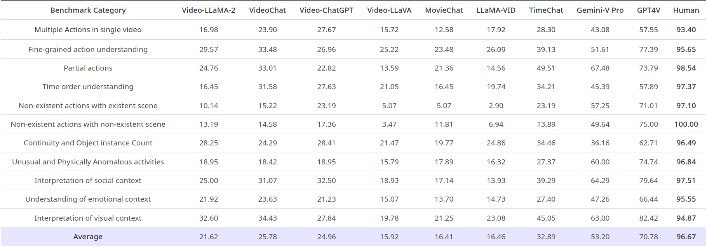
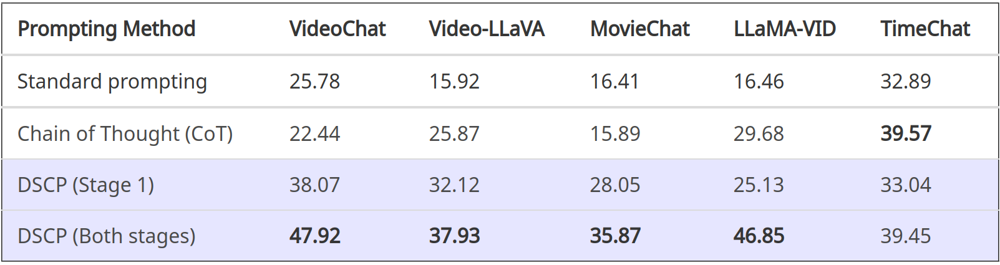

# How Good is my Video LMM? Complex Video Reasoning and Robustness Evaluation Suite for Video-LMMs

<p align="center">
    
</p>

> [**How Good is my Video LMM? Complex Video Reasoning and Robustness Evaluation Suite for Video-LMMs**](https://arxiv.org/abs/2405.03690) <br>
> [Muhammad Uzair Khattak](https://muzairkhattak.github.io/), [Muhammad Ferjad Naeem](https://ferjad.github.io/), [Jameel Hassan](https://jameelhassan.github.io/), [Muzammal Naseer](https://muzammal-naseer.com/), [Federico Tombari](https://federicotombari.github.io/), [Fahad Shahbaz Khan](https://sites.google.com/view/fahadkhans/home), [Salman Khan](https://salman-h-khan.github.io/)

**Mohamed bin Zayed University of AI, ETH Zurich,  Australian National University, Technical University of Munich, Linköping University, Google**

[](https://arxiv.org/abs/2405.03690)
[](https://mbzuaiac-my.sharepoint.com/:f:/g/personal/uzair_khattak_mbzuai_ac_ae/EktDA83_8UxJrc23DQfrfv8Bvw41YxWVBgD3Fapxs69rRg?e=hU7X5a)
[](https://mbzuai-oryx.github.io/CVRR-Evaluation-Suite/)

[//]: # ([![video]&#40;https://img.shields.io/badge/video-teaser-orange&#41;]&#40;&#41;)

[//]: # ([![slides]&#40;https://img.shields.io/badge/Presentation-Slides-B762C1&#41;]&#40;https://drive.google.com/file/d/1H7u4QJwLYijbLAL0eAVJco64f59OokQQ/view?usp=sharing&#41;)


Official GitHub repository for the CVRR-Evaluation Suite 

---


# :rocket: Release
* **(May 07, 2024)**
  * CVRR-ES evaluation dataset is released.
  * Technical report for CVRR-ES benchmark is released.
  * This repository supports inference codes for [Video-LLaVA](Video-LMMs-Inference/Video-LLaVA), [TimeChat](Video-LMMs-Inference/TimeChat), [Gemini-Pro-Vision (API)](Video-LMMs-Inference/Gemini-Pro-Vision) and [GPT4-Vision (API) models](Video-LMMs-Inference/GPT4(V)).
  
---

## Highlights
Motivated by the expanding wide-scale applications of Video Large Multi-modal Models (Video-LMMs), and the lack of complex video understanding benchmarking, we present a new evaluation benchmark, **Complex Video Reasoning and Robustness Evaluation Suite (CVRR-ES)** for Video-LMMs. CVRR-ES comprehensively evaluates the recent Video-LMMs against their reasoning capabilities over complex videos in the real-world context, and robustness of these models through the lens of user prompts as text queries.


> <p align="justify"> <b> <span style="color: blue;">Left</span></b>:
> Our Complex Video Reasoning and Robustness Evaluation Suite (CVRR-ES) comprises 11 diverse video evaluation dimensions
> encompassing a variety of complex and real-world contexts
> for evaluating Video Large Multi-modal Models (Video-LMMs).
> <b><span style="color: blue;">Right</span></b>:
> Overall performance of Video-LMMs on the CVRR-ES benchmark. 
> Results for each Video-LMM are averaged across 11 video dimensions shown on the left.


> **<p align="justify"> Abstract:** *Recent advancements in Large Language Models (LLMs) have led to the development of Video Large Multi-modal Models (Video-LMMs) 
> that can handle a wide range of video understanding tasks. These models 
> have the potential to be deployed in real-world applications such as 
> robotics, AI assistants, medical surgery, and autonomous vehicles. 
The widespread adoption of Video-LMMs in our daily lives underscores the 
> importance of ensuring and evaluating their robust performance in 
> mirroring human-like reasoning and interaction capabilities in complex, 
> real-world contexts. However, existing benchmarks for Video-LMMs primarily
> focus on general video comprehension abilities and neglect assessing their
> reasoning capabilities over complex videos in the real-world context, and
> robustness of these models through the lens of user prompts as text queries.
> In this paper, we present the Complex Video Reasoning and Robustness 
> Evaluation Suite (CVRR-ES), a novel benchmark that comprehensively 
> assesses the performance of Video-LMMs across 11 diverse real-world video
> dimensions. We evaluate 9 recent models, including both open-source and
> closed-source variants, and find that most of the Video-LMMs, especially 
> open-source ones, struggle with robustness and reasoning when dealing with
> complex videos. Based on our analysis, we develop a training-free Dual-Step
> Contextual Prompting (DSCP) technique to enhance the performance of existing
> Video-LMMs. Our findings provide valuable insights for building the next
> generation of human-centric AI systems with advanced robustness and 
> reasoning capabilities. Our dataset and code are publicly available.* </p>

## CVRR-ES assesses the reasoning and robustness of Video-LMMs on complex videos in real-world contexts.

**Main contributions:**
1) **Complex Video Reasoning and Robustness Benchmark:** We present CVRR-ES, an open-ended Video Question Answering benchmark designed to assess the reasoning and robustness capabilities of Video-LMMs across 11 diverse world-centric complex video dimensions.
2) **Comprehensive Evaluation:**  We evaluate recent Video-LMMs on the CVRR-ES benchmark and find that most models exhibit weak performance, highlighting their limited reasoning in complex videos and lack of robustness towards user text queries.
3) **Key Analysis:** We conduct extensive analysis and formulate important conclusions about Video-LMMs based on their failure cases and performance on the CVRR-ES benchmark. Our findings provide valuable insights for building the next generation of human-centric AI systems with improved robustness and reasoning capabilities.
4) **Dual-Step Contextual Prompting Technique:**  To improve Video-LMMs' reasoning and robustness abilities, we formulate a model-agnostic, training-free prompting technique that effectively enhances their performance on the CVRR-ES benchmark.

### Performance of Video-LMMs on CVRR-ES
In below table, we present the evaluation results of 9 recent Video-LMMs on the 11 dimension categories of the CVRR-ES benchmark.


### Effectiveness of DSCP method for improving Video-LMMs performance
We integrate DSCP technique with Video-LMMs and present results on the CVRR-ES benchmark in below Figure. DSCP improves the model's performance compared with models that use standard prompting (i.e., using only the question itself). Gains of DSCP technique are shown in green.


### Different prompting techniques
We study the contribution of each step of DSCP and compare it with the chain-of-thought prompting method. The results for the top 5 performing Video-LMMs are shown in the below Table. 



## Getting started with CVRR-ES

### Download CVRR-ES Dataset

CVRR-ES dataset can be downloaded [using this link (zipped)](https://mbzuaiac-my.sharepoint.com/:f:/g/personal/uzair_khattak_mbzuai_ac_ae/EktDA83_8UxJrc23DQfrfv8Bvw41YxWVBgD3Fapxs69rRg?e=8Nm0Rf). CVRR-ES benchmark consists of 2400 open-ended question-answer (QA) pairs spanning over 214 unique videos and covers 11 diverse evaluation dimensions.
After unzipping, the CVRR-ES dataset structure looks like the following:

```
CVRR-ES/
|–– interpretation_of_visual_context/
|   |–– annotations_interpretation_of_visual_context.json
|   |–– captions_interpretation_of_visual_context.json
|   |–– 163.mp4
|   |–– ... # remaining videos
|–– partial_actions/
|   |–– annotations_partial_actions.json
|   |–– captions_partial_actions.json
|   |–– 121.mp4
|   |–– ... # remaining videos
|–– unusual_and_physically_anomalous_activities/
|   |–– annotations_interpretation_of_visual_counusual_and_physically_anomalous_activities.json
|   |–– captions_unusual_and_physically_anomalous_activities.json
|   |–– 101.mp4
|   |–– ... # remaining videos
... # remaining video-evaluation dimension folders
```

Here, each folder corresponds to a single video evaluation dimension and contains annotations (QA pairs and captions) alongside videos. 


### Evaluating Video-LMMs on CVRR-Evaluation Suite
To evaluate Video-LMMs on the CVRR-ES benchmark, please follow the following steps:

#### 0) Installation
Follow the instructions in [INSTALL.md](assets/INSTALL.md) to install packages and model weights required to run the sample Video-LMM codes for evaluation. 

#### 1) Generating Predictions for CVRR-ES dataset from Video-LMMs

For each QA pair, we generate answers from Video-LMMs in an autoregressive manner. Predictions are generated using either standard prompting (i.e., question only) or using our Dual-Step Contextual Prompting technique (DSCP). Follow [PREDICTIONS.md](assets/PREDICTIONS.md) for sample codes for generating answers using TimeChat, Video-LLaVA, GPT4-Vision and Gemini-Vision-Pro. 

#### 2) Comparing the Predicted Answers with Ground-Truth Answers using LLM-Assisted evaluation
Once the answer predictions are generated from step 1, we utilize LLM as a Judge to measure/quantify the correctness of Video-LMMs prediction for each question in the CVRR-Evaluation Suite. Please follow the instructions in [LLM_SCORING.md](assets/LLM_SCORING.md) for using LMM-Assisted evaluation. 


<hr />

## License
This work is licensed under a Creative Commons Attribution-NonCommercial-ShareAlike 4.0 International License. The videos in CVRR-ES dataset are collected from public academic benchmarks (refer to [main paper](https://arxiv.org/pdf/2405.03690) for more details) and from YouTube and are for academic research use only. 
By using CVRR-ES, you agree not to use the dataset for any harm or unfair discrminiation. Please note that the data in this dataset may be subject to other agreements. Video copyrights belong to the original dataset providers, video creators, or platforms.


## Citation
If you find our work and this repository useful, please consider giving our repo a star and citing our paper as follows:
```bibtex
@article{Khattak2024cvrres,
    title={How Good is my Video LMM? Complex Video Reasoning and Robustness Evaluation Suite for Video-LMMs},
    author={khattak, Muhammad Uzair and Naeem, Muhammad Ferjad and Hassan, Jameel and Muzzamal, Naseer and Tombari, Federcio and Khan, Fahad Shahbaz and Khan, Salman},
    journal={arXiv:2405.03690},
    year={2024}
}
```

## Contact
If you have any questions, please create an issue on this repository or contact at uzair.khattak@mbzuai.ac.ae.


## Acknowledgements

This repository has borrowed Video-LMM evaluation code from [TimeChat](https://github.com/RenShuhuai-Andy/TimeChat) and [LLaMA-VID](https://github.com/dvlab-research/LLaMA-VID). We also borrowed partial code from [Video-ChatGPT](https://github.com/mbzuai-oryx/Video-ChatGPT) repository. We thank the authors for releasing their code.

